# 🧠 AFFiNE Brillian Patch: Personal Second Brain & Integration Hub

> An advanced, customized distribution of **AFFiNE** engineered as a centralized **Second Brain Hub** with deep integrations across **Paperless-ngx**, **Local LLMs / Ollama (Qwen-Embed)**, **Task Management (Todoist / Kanban)**, **Open-Symbols Iconography**, and an **Apple Liquid Glass Design System**.

---

## 📑 Table of Contents

1. [Project Overview & Vision](#-project-overview--vision)
2. [Architectural Backbone](#-architectural-backbone)
3. [Key Features & Capabilities](#-key-features--capabilities)
   - [1. Paperless-ngx Document Archiving & Deep Search](#1-paperless-ngx-document-archiving--deep-search)
   - [2. Local AI & Semantic Vector Search (Ollama + Qwen-Embed)](#2-local-ai--semantic-vector-search-ollama--qwen-embed)
   - [3. Todoist & Task Management Workflow](#3-todoist--task-management-workflow)
   - [4. Apple Liquid Glass Design System & Theme Engine](#4-apple-liquid-glass-design-system--theme-engine)
   - [5. Minimalist Grey Toolbar & Open-Symbols Iconography](#5-minimalist-grey-toolbar--open-symbols-iconography)
4. [Data Flow & Integration Diagrams](#-data-flow--integration-diagrams)
5. [Configuration & Environment Reference](#-configuration--environment-reference)
6. [Changelog & Version History](#-changelog--version-history)
7. [Third-Party Credits & Ecosystem Acknowledgments](#-third-party-credits--ecosystem-acknowledgments)

---

## 🌟 Project Overview & Vision

The **Brillian Patch** transforms standard AFFiNE into a unified, privacy-first personal knowledge operations platform. Rather than operating in isolated silos, documents from physical scanners, tasks from daily management tools, vector embeddings from local neural networks, and rich multimodal markdown notes converge into a single, cohesive user experience.

### Core Tenets

- 🔒 **100% Local & Self-Hosted Privacy**: No telemetry leaks; all vector indexing, semantic search, and document previewing operate on local network infrastructure.
- ⚡ **Sub-100ms Latency**: Fast-path REST searches run in parallel with asynchronous vector embedding searches.
- 🎨 **macOS Aesthetic & Liquid Glass Refraction**: Glassmorphic specular borders, dynamic backdrop blur, vibrant macOS blue active highlights, and clean typography.
- 🔗 **Zero-Friction Deep Linking**: Native protocol interceptors (`paperless://`, `/paperless-doc/:id`, AI citations) launch integrated PDF viewers directly inside AFFiNE without context-switching.

---

## 🏗️ Architectural Backbone

The architecture connects five core layers across the self-hosted environment:

```
┌─────────────────────────────────────────────────────────────────────────┐
│                           AFFiNE Frontend Client                         │
│  (BlockSuite Engine • CMDK QuickSearch • In-App PDF Viewer • Liquid Glass) │
└─────────────────┬─────────────────────────────────────┬─────────────────┘
                  │                                     │
      [REST / CORS / Proxy]                 [Model Context Protocol (MCP)]
                  │                                     │
┌─────────────────▼──────────────────┐   ┌──────────────▼─────────────────┐
│     Nginx Proxy Manager (443)      │   │   Paperless-MCP Server (:3001) │
│   (CORS Headers • SSL Termination) │   │   (SSE JSON-RPC 2.0 Streaming) │
└─────────────────┬──────────────────┘   └──────────────┬─────────────────┘
                  │                                     │
┌─────────────────▼──────────────────┐   ┌──────────────▼─────────────────┐
│    Paperless-ngx Webserver (:8000) │   │     Ollama Vector Engine       │
│  (Document Ingest • OCR • Metadata)│   │  (qwen-embed • 1024 Dim Vectors│
│   • PostgreSQL & Redis Cache       │   │   Local Distance Computation)  │
└────────────────────────────────────┘   └────────────────────────────────┘
```

### Component Breakdown

| Component | Port / Location | Role & Purpose |
| :--- | :--- | :--- |
| **AFFiNE Web Frontend** | `:3010` (`/data/affine/static`) | Client application running BlockSuite, QuickSearch providers, and Liquid Glass UI. |
| **AFFiNE Server Backend** | `:3010` (`affine_server`) | Workspace synchronization engine, real-time collaboration gateway, and doc storage. |
| **Paperless-MCP Bridge** | `:3001` (`paperless-mcp`) | Model Context Protocol server exposing `search_documents`, `semantic_search`, and `get_documents`. |
| **Ollama Embedding Node** | `:11434` (`paperless-ollama`) | Generates local high-dimensional vector embeddings via `qwen-embed`. |
| **Paperless-ngx Engine** | `:8000` / `paperless.yourdomain.com` | Optical Character Recognition (OCR), document storage, and REST metadata endpoint. |
| **Nginx Proxy Manager** | `:80` / `:443` | Reverse proxy orchestrator providing SSL certificates, CORS preflight handling, and security headers. |

---

## ✨ Key Features & Capabilities

### 1. Paperless-ngx Document Archiving & Deep Search

- **Parallel Dual-Track Search**:
  - *Track A (Instant Keyword)*: Immediately queries `/api/documents/?query=<term>` against Paperless REST API for exact matches (<80ms).
  - *Track B (Semantic Meaning)*: Dispatches vector embeddings query to Paperless-MCP via `qwen-embed` for conceptual matches.
  - Results are merged, deduplicated by ID, and ranked with high group priority (`score: 12`) in the Ctrl/Cmd+K CMDK modal.
- **Embedded Modal PDF Viewer (`PaperlessViewerModal`)**:
  - Clicking any search result or linked document loads the document inside an in-app viewer modal.
  - Automatically fetches authenticated binary PDF blobs using the internal token and streams them securely via `URL.createObjectURL`.
- **Global Link Interception**:
  - Intercepts `paperless://<docId>`, `paperless.yourdomain.com/documents/<docId>`, and `/paperless-doc/<docId>` anywhere in the DOM (including inside BlockSuite Shadow DOM and AI chat footnotes), routing clicks directly to the native modal viewer.

### 2. Local AI & Semantic Vector Search (Ollama + Qwen-Embed)

- Self-hosted Ollama container hosting `qwen-embed` with 1024-dimension vector embeddings.
- Automatic vector indexing of document OCR text layers.
- Calculates cosine distance ranking and maps scores to human-readable percentages (`Relevance: 85%`).

### 3. Todoist & Task Management Workflow

- Integrated custom Todo sidebar views (`AppSidebarTodoButton`, `todo-page`).
- Replaced emoji-based checklist bullets and task symbols with unified SVG iconography.
- Direct quick links and task organization within sidebar folders.

### 4. Apple Liquid Glass Design System & Theme Engine

- **Refraction & Specular Highlights**:
  - CSS glassmorphism leveraging `backdrop-filter: blur(36px) saturate(200%)`.
  - Translucent overlays (`rgba(255, 255, 255, 0.85)` / `rgba(30, 30, 32, 0.82)`).
  - 1px specular lighting top/left borders for realism.
- **macOS Vibrant Blue Active Item States**:
  - Active documents, pages, and settings tabs use the signature macOS active blue pill (`#007aff !important` with `box-shadow: 0 2px 8px rgba(0, 122, 255, 0.35)`).
  - High-contrast pure white typography and icons (`#ffffff !important`).
- **Clean Sync Status**:
  - Independent status indicator styling keeping syncing badges minimal without unwanted background pills.

### 5. Minimalist Grey Toolbar & Open-Symbols Iconography

- System-wide replacement of default emojis with [Open-Symbols](https://github.com/OrchardKit/open-symbols).
- Monochromatic grey color palette (`#8e8d91`) for editor tools, menus, and format bars.
- Pill-shaped floating format bars with rounded borders.

---

## 🔄 Data Flow & Integration Diagrams

### CMDK Quick Search Flow (REST + Vector MCP)

```mermaid
sequenceDiagram
    autonumber
    actor User
    participant CMDK as QuickSearch (CMDK)
    participant REST as Paperless REST API
    participant MCP as Paperless-MCP Server
    participant Ollama as Ollama (qwen-embed)
    participant Viewer as PaperlessViewerModal

    User->>CMDK: Types query "invoice"
    par Immediate Fast Path
        CMDK->>REST: GET /api/documents/?query=invoice
        REST-->>CMDK: 200 OK (JSON Results)
        CMDK->>User: Render immediate keyword matches
    and Parallel Semantic Path
        CMDK->>MCP: POST /mcp tools/call "semantic_search"
        MCP->>Ollama: Generate vector embedding for "invoice"
        Ollama-->>MCP: [1024 dim vector]
        MCP-->>CMDK: SSE stream (Distance ranked results)
        CMDK->>User: Merge & update semantic relevance scores
    end

    User->>CMDK: Clicks on "INV-202609-0001"
    CMDK->>Viewer: Open PaperlessViewerModal(docId=1)
    Viewer->>REST: GET /api/documents/1/download/ (Blob)
    REST-->>Viewer: PDF Binary Stream
    Viewer->>User: Display interactive PDF preview
```



---

## ⚙️ Configuration & Environment Reference

### Key Environment Variables (`paperless-mcp`)

```env
PORT=3001
MCP_TRANSPORT=http
EMBEDDINGS_ENABLED=true
EMBEDDING_PROVIDER=ollama
OLLAMA_URL=http://paperless-ngx-ollama-1:11434
EMBEDDING_MODEL=qwen-embed
EMBEDDING_DIMENSIONS=1024
PAPERLESS_URL=http://paperless-ngx-webserver-1:8000
PAPERLESS_TOKEN=YOUR_PAPERLESS_API_TOKEN
PAPERLESS_MCP_DATA=/data
```

### Nginx Proxy Manager CORS Headers (`/data/nginx/proxy_host/49.conf`)

```nginx
# CORS Configuration for Universal Access
add_header 'Access-Control-Allow-Origin' '*' always;
add_header 'Access-Control-Allow-Methods' 'GET, POST, OPTIONS, PUT, DELETE' always;
add_header 'Access-Control-Allow-Headers' 'DNT,User-Agent,X-Requested-With,If-Modified-Since,Cache-Control,Content-Type,Range,Authorization,X-Paperless-Token,mcp-session-id' always;
add_header 'Access-Control-Expose-Headers' 'Content-Length,Content-Range,mcp-session-id' always;
```

---

## 📜 Changelog & Version History

### [v1.4.0] — 2026-09-07
- **Added**: Settings modal active tab blue highlight (`#007aff`) with white text and icons.
- **Added**: Universal modal background blur (`backdrop-filter: blur(20px) saturate(180%)`) across dialog overlays and settings sidebars.
- **Fixed**: Active document sidebar highlight restored with high-contrast pure white text.
- **Fixed**: Syncing indicator status decoupled from active page background styling.

### [v1.3.0] — 2026-09-07
- **Added**: Parallel dual-track search in `PaperlessQuickSearchSession` (REST fast-path + Ollama semantic vector search).
- **Added**: Robust SSE streaming parser supporting `: keepalive` and chunked JSON-RPC frames.
- **Added**: Nginx Proxy Manager CORS configuration for Paperless REST endpoints.
- **Enhanced**: Elevated Paperless CMDK group score to `12` for prominent search rankings.

### [v1.2.0] — 2026-09-07
- **Added**: `PaperlessViewerModal` in-app PDF preview component with token-authenticated blob streaming.
- **Added**: DOM link interceptor for `paperless://`, `/paperless-doc/:id`, and direct web URLs.
- **Added**: Global event bus trigger `affine:open-paperless-viewer`.

### [v1.1.0] — 2026-09-07
- **Added**: Apple Liquid Glass styling engine (frosted panels, specular borders, rounded toolbars).
- **Added**: OrchardKit [open-symbols](https://github.com/OrchardKit/open-symbols) icon set replacing emojis across UI, todo pages, and navigation trees.
- **Updated**: Editor toolbar items aligned to minimalist monochromatic grey (`#8e8d91`).

---

## 💖 Third-Party Credits & Ecosystem Acknowledgments

This project is built on the shoulders of remarkable open-source projects:

- **[AFFiNE](https://github.com/toeverything/AFFiNE)** by *TOEVERYTHING PTE. LTD.* — The next-generation all-in-one knowledge base, canvas, and collaborative workspace.
- **[BlockSuite](https://github.com/toeverything/blocksuite)** — High-performance collaborative block-based editor engine.
- **[Paperless-ngx](https://github.com/paperless-ngx/paperless-ngx)** — Community-driven document management system that transforms physical documents into searchable digital archives.
- **[Open-Symbols](https://github.com/OrchardKit/open-symbols)** by *OrchardKit* — Clean, open-source Apple SF-style symbols.
- **[Ollama](https://github.com/ollama/ollama)** — High-performance framework for running large language and embedding models locally.
- **[Qwen-Embed](https://huggingface.co/Qwen)** by *Alibaba Cloud* — Multi-language text embedding models for semantic retrieval.
- **[Todoist](https://todoist.com)** — Task and productivity management inspiration for the integrated workflow.
- **[Nginx Proxy Manager](https://nginxproxymanager.com/)** — Simple and powerful reverse proxy management interface.

---

*Maintained as part of the **Brillian Second Brain Ecosystem**.*
