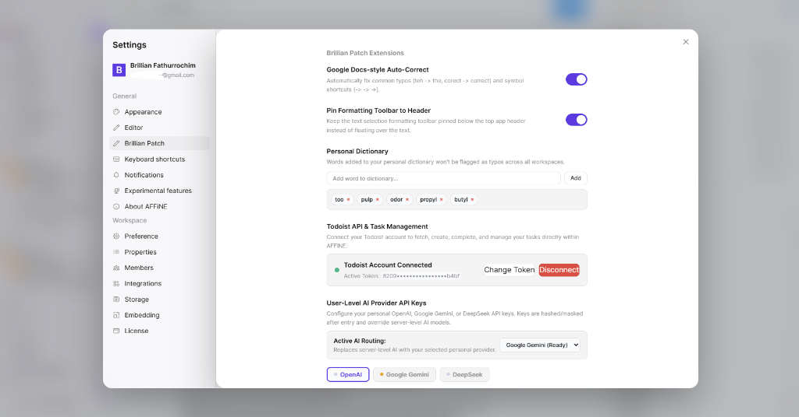
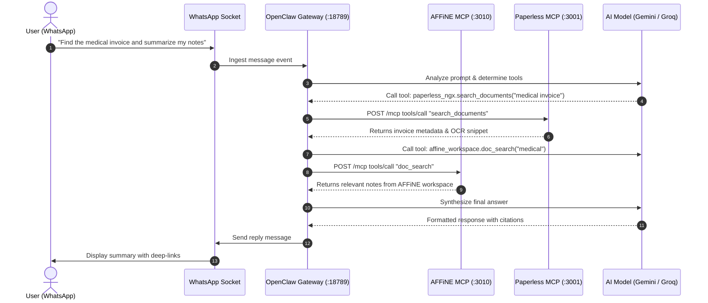

# 🧠 AFFiNE Brillian Patch: Personal Second Brain & Multi-Stack Hub

> A comprehensive, privacy-first **Second Brain Ecosystem** integrating **AFFiNE**, **WhatsApp (via OpenClaw Gateway)**, **Paperless-ngx**, **Local LLMs / Ollama (Qwen-Embed)**, **Todoist Task Automation**, and an **Apple Liquid Glass Design System**.

<p align="center">
  
</p>

---

## 📑 Table of Contents

1. [Project Overview & Vision](#-project-overview--vision)
2. [Complete System Architecture](#-complete-system-architecture)
3. [Stack Components & Directory Structure](#-stack-components--directory-structure)
4. [Integrated Capabilities](#-integrated-capabilities)
   - [1. WhatsApp & Telegram AI Assistant (OpenClaw Gateway)](#1-whatsapp--telegram-ai-assistant-openclaw-gateway)
   - [2. AFFiNE Workspace MCP Server (Zero-Friction Doc Access)](#2-affine-workspace-mcp-server-zero-friction-doc-access)
   - [3. Paperless-ngx Document Archiving & Dual-Track Search](#3-paperless-ngx-document-archiving--dual-track-search)
   - [4. Local AI & Semantic Vector Search (Ollama + Qwen-Embed)](#4-local-ai--semantic-vector-search-ollama--qwen-embed)
   - [5. Apple Liquid Glass Design System & Theming Engine](#5-apple-liquid-glass-design-system--theming-engine)
   - [6. Todoist & Task Management Pipeline](#6-todoist--task-management-pipeline)
5. [Data Flow & Communication Diagrams](#-data-flow--communication-diagrams)
6. [Deployment & Configuration Guide](#-deployment--configuration-guide)
7. [Changelog & Version History](#-changelog--version-history)
8. [Third-Party Credits & Ecosystem Acknowledgments](#-third-party-credits--ecosystem-acknowledgments)

---

## 🌟 Project Overview & Vision

The **Brillian Patch & Second Brain Hub** converges personal document archiving, notes, task management, and mobile messaging into a single, cohesive operating environment. Rather than context-switching between isolated tools:

- **WhatsApp** acts as an omnipresent conversational input node.
- **OpenClaw** serves as the autonomous gateway routing requests via **Model Context Protocol (MCP)**.
- **AFFiNE** provides the canvas, workspace notes, and structured knowledge repository.
- **Paperless-ngx** and **Ollama** manage physical scans, OCR, and local high-dimensional vector embeddings.
- **Todoist** syncs and schedules actionable items in real-time.

---

## 🏗️ Complete System Architecture

```
┌────────────────────────────────────────────────────────────────────────┐
│                      Mobile & Conversational Layer                     │
│               WhatsApp (Baileys)   •   Telegram Bot Polling            │
└───────────────────────────────────┬────────────────────────────────────┘
                                    │ WebSockets / Socket Transport
┌───────────────────────────────────▼────────────────────────────────────┐
│                       OpenClaw Gateway Engine (:18789)                 │
│        (Autonomous Agentic Supervisor • Gemini / Groq Fallbacks)       │
└──────────────────┬─────────────────────────────────┬───────────────────┘
                   │                                 │
      [Streamable-HTTP MCP]             [Streamable-HTTP MCP]
                   │                                 │
┌──────────────────▼───────────────┐   ┌─────────────▼──────────────────┐
│     AFFiNE Server (:3010)        │   │   Paperless-MCP Server (:3001) │
│ (Workspace MCP: read_document,   │   │ (search_documents,             │
│  doc_search • BlockSuite Engine) │   │  semantic_search, get_document)│
└──────────────────┬───────────────┘   └─────────────┬──────────────────┘
                   │                                 │
                   │                         [Internal Docker]
                   │                                 │
┌──────────────────▼───────────────┐   ┌─────────────▼──────────────────┐
│       AFFiNE Frontend UI         │   │  Paperless-ngx Engine (:8000)  │
│ (Liquid Glass Theme • OpenSymbols│   │  Ollama Vector Engine (:11434) │
│  In-App PDF Viewer • Todoist UI) │   │  (qwen-embed • 1024 Dim Vectors│
└──────────────────────────────────┘   └────────────────────────────────┘
```

### Component Breakdown & Ports

| Component | Network Port | Role & Purpose |
| :--- | :--- | :--- |
| **WhatsApp Channel** | Socket / Web | Primary conversational interface via Baileys and OpenClaw. |
| **OpenClaw Gateway** | `:18789` | Autonomous agent runtime routing tasks and MCP tool executions. |
| **AFFiNE Server** | `:3010` | Real-time collaborative workspace, storage, and workspace MCP provider. |
| **AFFiNE Web Client** | `:3010` / Web | Client interface running BlockSuite, QuickSearch, and Liquid Glass UI. |
| **Paperless-MCP Server** | `:3001` | SSE and HTTP JSON-RPC 2.0 bridge exposing document search tools. |
| **Paperless-ngx Engine** | `:8000` | Automated OCR, document metadata, storage, and REST backend. |
| **Ollama Node** | `:11434` | Self-hosted neural embeddings engine running `qwen-embed`. |
| **Todoist Proxy Server** | `:3002` | Secure local proxy facilitating CORS-free Todoist task sync. |

---

## 📁 Stack Components & Directory Structure

```
affine-brillian-patch/
├── assets/
│   └── hero-preview.png                      # Settings and UI extension banner
├── config/
│   └── openclaw.example.json                 # Gateway, WhatsApp, and MCP bridge configuration
├── docker/
│   ├── docker-compose.affine.yml             # AFFiNE Server, PostgreSQL 16, Redis 7 stack
│   └── docker-compose.paperless-ai.yml       # Paperless-ngx, MCP Bridge, Ollama stack
├── patches/
│   └── affine-brillian-patch-v1.4.0.patch    # 1-Click clean git diff patch for AFFiNE
├── scripts/
│   ├── apply-patch.sh                        # Linux / macOS installation script
│   └── apply-patch.ps1                       # Windows PowerShell installation script
├── systemd/
│   ├── openclaw.service.example              # OpenClaw supervisor systemd daemon
│   └── todoist-server.service.example        # Todoist local sync proxy service
└── src/
    ├── paperless/                            # Paperless REST & semantic search integration
    ├── spellcheck/                           # High-performance canvas spellcheck overlay
    ├── theming/                              # Apple Liquid Glass CSS & macOS blue active states
    └── todoist/                              # Kanban card components, habit tracking, and sync
```

---

## ✨ Integrated Capabilities

### 1. WhatsApp & Telegram AI Assistant (OpenClaw Gateway)
- **Natural Language Knowledge Querying**: Send a message like *"What did the contract from Acme specify about warranty?"* or *"Summarize my meeting notes on project alpha"*.
- **Agentic Multi-Step Reasoning**: OpenClaw parses the intent, queries the AFFiNE workspace or Paperless-ngx via MCP, synthesizes the context, and responds in WhatsApp.
- **Failover LLM Routing**: Primary reasoning backed by Google Gemini with automatic seamless fallback to Groq models (Llama-3, DeepSeek, Qwen).

### 2. AFFiNE Workspace MCP Server (Zero-Friction Doc Access)
- **Native MCP Endpoints**: AFFiNE exposes `/api/workspaces/:id/mcp` authenticated by standard `aff_mcp_v1` tokens.
- **Exposed Tools**:
  - `doc_search`: Performs bounded semantic search over workspace pages and canvas blocks.
  - `read_document`: Fetches clean Markdown content for any page ID.

### 3. Paperless-ngx Document Archiving & Dual-Track Search
- **Parallel Search in AFFiNE**:
  - *Track A (Instant Keyword)*: Queries `/api/documents/?query=<term>` against Paperless REST API (<80ms).
  - *Track B (Semantic Meaning)*: Queries vector embeddings via Paperless-MCP with `qwen-embed`.
- **Embedded Modal PDF Viewer (`PaperlessViewerModal`)**: Authenticated binary streaming via `URL.createObjectURL` without downloading external files.
- **Global Link Interceptor**: Clicks on `paperless://<id>` or web URLs automatically launch the internal modal viewer.

### 4. Local AI & Semantic Vector Search (Ollama + Qwen-Embed)
- Self-hosted Ollama container generating 1024-dimensional vector embeddings locally.
- Automatic cosine distance calculation and score normalization (`Relevance: 85%`).

### 5. Apple Liquid Glass Design System & Theming Engine
- **Glassmorphic Depth**: `backdrop-filter: blur(36px) saturate(200%)` with 1px specular lighting borders.
- **macOS Active State**: Active sidebar items, document rows, and settings tabs use the signature `#007aff` blue pill with crisp white typography.
- **Open-Symbols Iconography**: Clean SF-style symbols replacing generic emojis.

### 6. Todoist & Task Management Pipeline
- Sidebar integration with custom habit trackers and draggable task cards.
- Real-time synchronization handled through local background proxy (`:3002`).

---

## 🔄 Data Flow & Communication Diagrams

### Conversational WhatsApp ⇄ MCP Integration Flow



---

## ⚙️ Deployment & Configuration Guide

### 1. Launching the Multi-Container Stacks

```bash
# 1. Start Paperless-ngx, MCP Bridge, and Ollama
docker compose -f docker/docker-compose.paperless-ai.yml up -d

# 2. Start AFFiNE Server, PostgreSQL, and Redis
docker compose -f docker/docker-compose.affine.yml up -d
```

### 2. Configuring OpenClaw Gateway

Copy the example configuration:
```bash
cp config/openclaw.example.json ~/.openclaw/openclaw.json
```
Populate your environment tokens:
- `mcp.servers.affine_workspace.headers.Authorization`: Generate an `aff_mcp_v1` credential in AFFiNE Settings.
- `mcp.servers.paperless_ngx.headers.Authorization`: Provide your Paperless API token.
- `plugins.entries.todoist.config.apiToken`: Provide your Todoist API token.

### 3. Enabling System Services

```bash
# Install OpenClaw Gateway daemon
sudo cp systemd/openclaw.service.example /etc/systemd/system/openclaw.service
sudo systemctl daemon-reload
sudo systemctl enable --now openclaw.service

# Install Todoist Proxy daemon
sudo cp systemd/todoist-server.service.example /etc/systemd/system/todoist-server.service
sudo systemctl enable --now todoist-server.service
```

### 4. Applying the AFFiNE Patch

```bash
# On Linux / macOS:
chmod +x scripts/apply-patch.sh
./scripts/apply-patch.sh /path/to/affine-monorepo

# On Windows PowerShell:
.\scripts\apply-patch.ps1 -TargetRepo "D:\Apps\Affine"
```

---

## 📜 Changelog & Version History

### [v1.4.0] — 2026-09-07
- **Added**: Multi-stack integration hub documentation and deployment definitions.
- **Added**: Native WhatsApp & Telegram bidirectional assistant routing via OpenClaw Gateway.
- **Added**: AFFiNE Workspace MCP Server integration (`read_document`, `doc_search`).
- **Added**: Settings modal active tab blue highlight (`#007aff`) with white typography.
- **Added**: Universal modal background blur (`backdrop-filter: blur(20px) saturate(180%)`).
- **Fixed**: Syncing indicator status decoupled from active page background styling.

### [v1.3.0] — 2026-09-07
- **Added**: Parallel dual-track search in `PaperlessQuickSearchSession` (REST + Ollama semantic vector search).
- **Added**: Robust SSE streaming parser supporting `: keepalive` and chunked JSON-RPC frames.
- **Added**: Nginx Proxy Manager CORS configuration for Paperless REST endpoints.

---

## 💖 Third-Party Credits & Ecosystem Acknowledgments

- **[AFFiNE](https://github.com/toeverything/AFFiNE)** by *TOEVERYTHING PTE. LTD.* — The next-generation collaborative knowledge base and canvas.
- **[OpenClaw](https://openclaw.ai)** — Gateway supervisor and autonomous agent orchestration platform.
- **[Paperless-ngx](https://github.com/paperless-ngx/paperless-ngx)** — Community-driven digital document management system.
- **[Ollama](https://github.com/ollama/ollama)** — Local machine learning and vector embedding engine.
- **[Qwen-Embed](https://huggingface.co/Qwen)** by *Alibaba Cloud* — Multi-language text embedding model.
- **[Open-Symbols](https://github.com/OrchardKit/open-symbols)** by *OrchardKit* — Clean, open-source SF-style iconography.
- **[Todoist](https://todoist.com)** — Task and productivity management inspiration.

---

*Part of the **Brillian Second Brain Ecosystem**.*
